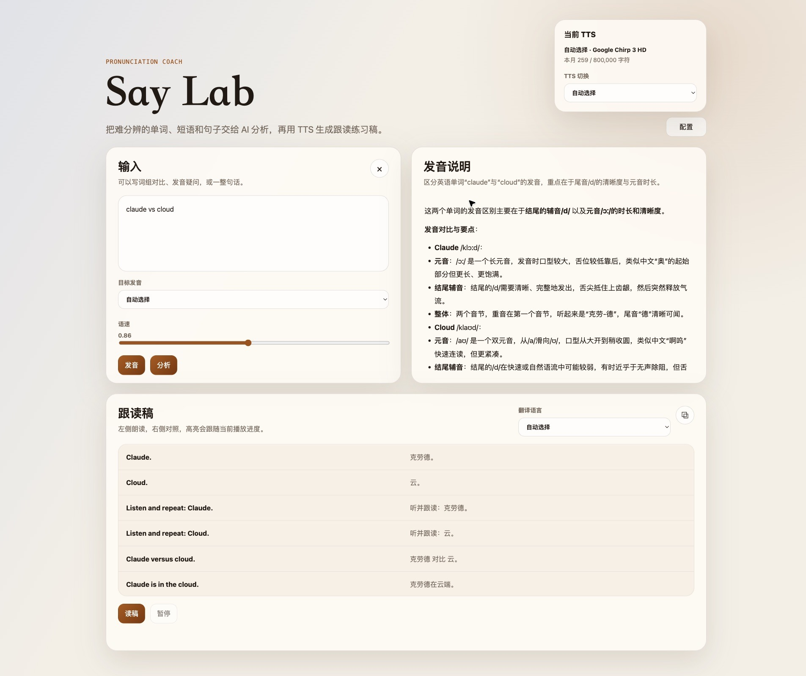
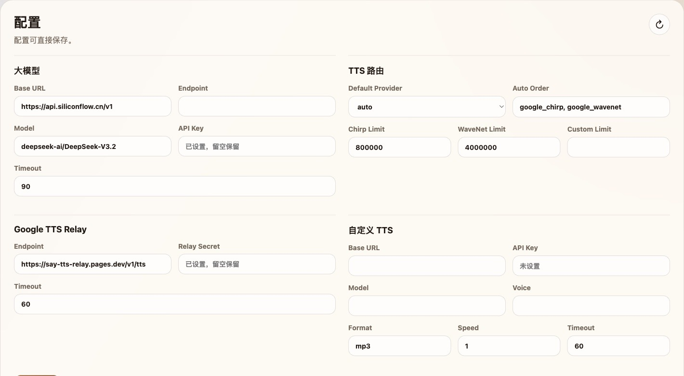

# Say Lab

   


这是一个轻量自托管发音练习页面。你可以输入单词、短语、句子或发音疑问，让大模型生成发音说明和双语跟读稿，再用云端 TTS 朗读。

Demo 地址：[https://demo.saylab.ganfan.work/](https://demo.saylab.ganfan.work/)

英文文档：[README.en.md](README.en.md)

## 功能

- 朗读输入内容，适合快速听单词、短语或整句发音
- 生成发音说明，帮助区分容易混淆的读音
- 生成双语跟读稿，并在朗读时高亮当前句子
- 在前端配置大模型和 TTS 服务



## 配置

Say Lab 默认读取 `config.json`。也可以用 `-config /path/to/config.json` 或 `SAY_CONFIG` 指定路径。前端“配置”面板读写同一个配置文件；环境变量存在时会覆盖配置文件里的对应值。

先复制示例文件：

```bash
cp config.example.json config.json
```

配置示例如下。真实环境中请勿带注释，保持标准 JSON 格式：

```jsonc
{
  // 服务监听地址。反向代理部署时通常保持本地地址。
  "listen": "127.0.0.1:5567",

  // TTS 月度字符统计文件。
  "data_file": "data/usage.json",

  // 大模型配置，用于生成发音说明和跟读稿。
  "llm": {
    // OpenAI-compatible API 地址。
    "base_url": "https://api.deepseek.com/v1",

    // 可选。留空时默认使用 base_url + /chat/completions。
    "endpoint": "",

    "model": "deepseek-chat",
    "api_key": "",

    // 请求超时时间，单位秒。
    "timeout": 90
  },

  // TTS 配置，用于朗读输入内容和跟读稿。
  "tts": {
    // auto 会自动选择已配置且可用的 TTS 服务。
    "default_provider": "auto",

    // 自动选择优先级。只配置自定义 TTS 时也可保持默认。
    "auto_order": ["google_chirp", "google_wavenet"],

    // 月度字符上限。达到上限后 auto 会尝试下一个服务。
    "monthly_limits": {
      "google_chirp": 800000,
      "google_wavenet": 4000000
    },

    // Google TTS。填写 Google Cloud 服务账号里的对应字段。
    "google": {
      "project_id": "",
      "client_email": "",
      "private_key": "",
      "private_key_id": "",
      "token_url": "https://oauth2.googleapis.com/token",
      "tts_url": "https://texttospeech.googleapis.com/v1/text:synthesize",
      "timeout": 60
    },

    // Google TTS 中转服务，可选；前端配置面板不显示这一项。
    "google_relay": {
      "endpoint": "",
      "relay_secret": "",
      "timeout": 60
    },

    // 自定义 TTS。只使用自定义 TTS 时，填好这里并保持 default_provider 为 auto 即可。
    "custom": {
      "base_url": "",
      "api_key": "",
      "model": "",
      "voice": "",
      "response_format": "mp3",
      "speed": 1,
      "timeout": 60
    }
  }
}
```

[Google Chirp 3 HD / WaveNet](https://console.cloud.google.com/apis/library/texttospeech.googleapis.com) 通常每月提供100 / 400 万字符免费额度，一般足以满足个人用途使用。

如在中国大陆服务器部署，可能需要配置中转服务。

## 配置项

| 配置 | 作用 | 推荐写法 |
| --- | --- | --- |
| `listen` | 服务监听地址 | 反向代理部署时可保持 `127.0.0.1:5567` |
| `data_file` | TTS 月度字符统计 | 默认 `data/usage.json` |
| `llm.*` | 发音说明和跟读稿使用的大模型 | 填 `base_url`、`model`、`api_key` |
| `tts.default_provider` | 默认朗读服务 | 通常保持 `auto` |
| `tts.auto_order` | `auto` 时的选择顺序 | 默认顺序：`google_chirp`、`google_wavenet`、`custom` |
| `tts.monthly_limits` | provider 月度字符上限 | 达到上限后，`auto` 会尝试下一个 provider |
| `tts.google.*` | Google TTS | 填 `project_id`、`client_email`、`private_key` |
| `tts.google_relay.*` | Google TTS 中转 | 仅需要中转时在配置文件或环境变量里填写 |
| `tts.custom.*` | 自定义 TTS | OpenAI-compatible Speech API |

常用环境变量：

| 环境变量 | 对应配置 |
| --- | --- |
| `SAY_CONFIG` | 配置文件路径 |
| `SAY_LLM_API_KEY` | `llm.api_key` |
| `SAY_LLM_BASE_URL` | `llm.base_url` |
| `SAY_LLM_ENDPOINT` | `llm.endpoint` |
| `SAY_LLM_MODEL` | `llm.model` |
| `SAY_LLM_TIMEOUT` | `llm.timeout` |
| `SAY_GOOGLE_PROJECT_ID` | `tts.google.project_id` |
| `SAY_GOOGLE_CLIENT_EMAIL` | `tts.google.client_email` |
| `SAY_GOOGLE_PRIVATE_KEY_ID` | `tts.google.private_key_id` |
| `SAY_GOOGLE_PRIVATE_KEY` | `tts.google.private_key` |
| `SAY_GOOGLE_TTS_URL` | `tts.google.tts_url` |
| `SAY_GOOGLE_RELAY_SECRET` | `tts.google_relay.relay_secret` |
| `SAY_GOOGLE_RELAY_ENDPOINT` | `tts.google_relay.endpoint` |
| `SAY_TTS_DEFAULT_PROVIDER` | `tts.default_provider` |
| `SAY_TTS_AUTO_ORDER` | `tts.auto_order` |
| `SAY_TTS_CUSTOM_API_KEY` | `tts.custom.api_key` |
| `SAY_TTS_CUSTOM_BASE_URL` | `tts.custom.base_url` |
| `SAY_TTS_CUSTOM_MODEL` | `tts.custom.model` |
| `SAY_TTS_CUSTOM_VOICE` | `tts.custom.voice` |

也可通过前端界面配置大模型、Google TTS、自定义 TTS 和 TTS 路由。



## 启动

```bash
go run . -config config.json
```

然后打开：

```text
http://127.0.0.1:5567/
```

生产环境可以参考 `deploy/say-lab.service` 和 `deploy/nginx-say-lab.conf` 接入 systemd 与 Nginx。
